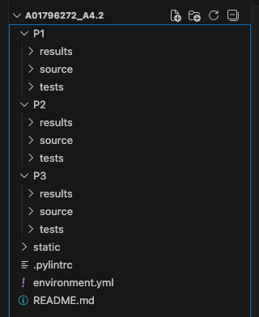
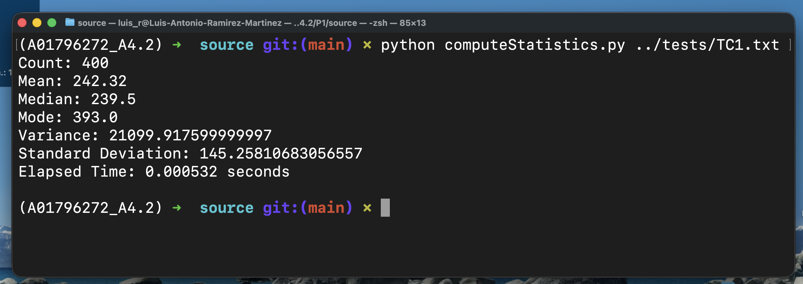
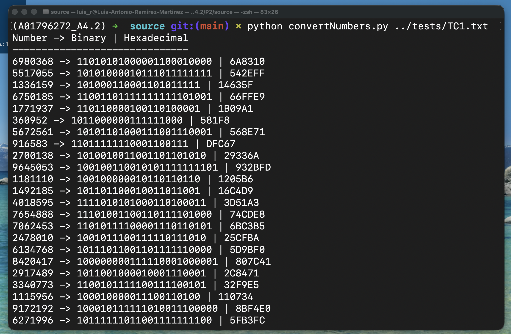
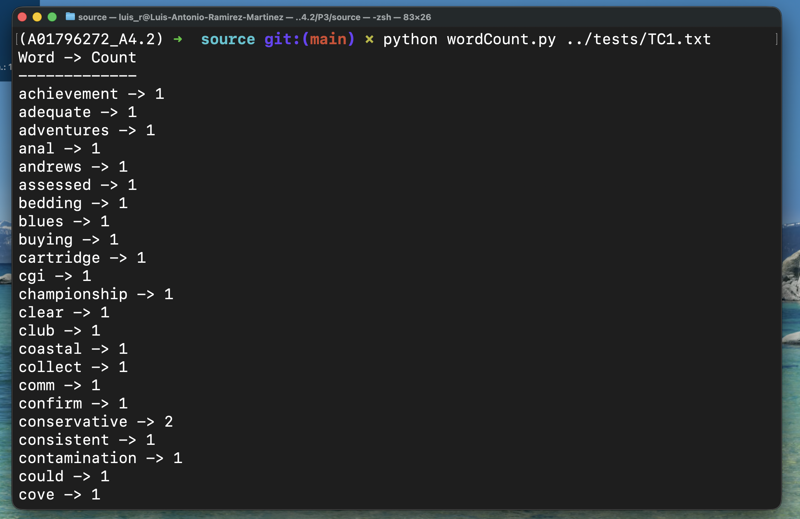
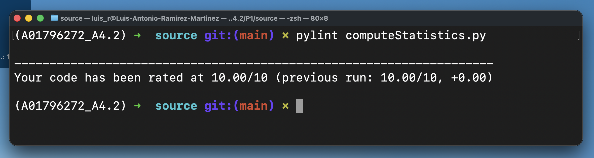
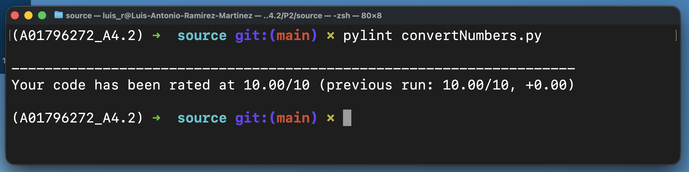
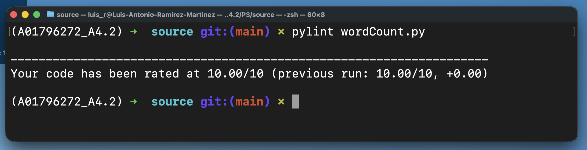

# Instituto Tecnológico de Estudios Superiores de Monterrey
## Maestría en Inteligencia Artificial Aplicada
## Pruebas de software y aseguramiento de la calidad
## 4.2 Ejercicio de programación 1
### A01796272 - Luis Antonio Ramírez Martínez


## 📌 Descripción General
Este repositorio contiene la solución de la **Actividad 4.2**, la cual consiste en la implementación de **tres ejercicios de programación** utilizando el lenguaje **Python**.

Los programas fueron desarrollados siguiendo el **estándar de codificación PEP-8**, utilizando **algoritmos básicos**, manejo de archivos y control de errores.
Además, se verificó la calidad del código mediante la herramienta **pylint**, corrigiendo los avisos detectados.

---

## 🎯 Objetivos de la Actividad
- Implemnetar un estándar de codificación.
- Validar la calidad del código mediante pylint.
- Documentar pruebas y resultados.

---

## 🗂 Estructura del Repositorio



---

## 🧮 Ejercicio 1 – Cálculo de Estadísticas

**Archivo:** `computeStatistics.py`

### Descripción
Lee un archivo con números y calcula:
- Cantidad
- Media
- Mediana
- Moda
- Varianza
- Desviación estándar

Los cálculos se realizan con algoritmos básicos, sin usar librerías matemáticas.

### Ejecución
```
python computeStatistics.py numbers.txt
```

Genera el archivo `StatisticsResults.txt` e incluye el tiempo de ejecución.




---

## 🔢 Ejercicio 2 – Conversión de Números

**Archivo:** `convertNumbers.py`

### Descripción
Convierte números enteros a:
- Binario
- Hexadecimal

Las conversiones se realizan manualmente, sin usar `bin()` ni `hex()`.

### Ejecución
```
python convertNumbers.py numbers.txt
```


Genera el archivo `ConvertionResults.txt` e incluye el tiempo de ejecución.

---

## 📝 Ejercicio 3 – Conteo de Palabras

**Archivo:** `wordCount.py`

### Descripción
Analiza un archivo de texto para:
- Identificar palabras distintas
- Contar la frecuencia de cada palabra

Las palabras se normalizan a minúsculas y se eliminan signos de puntuación.

### Ejecución
```
python wordCount.py words.txt
```



Genera el archivo `WordCountResults.txt` e incluye el tiempo de ejecución.

---

## 🧪 Archivos de Prueba
Se utilizaron archivos con:
- Datos válidos
- Datos inválidos
- Líneas vacías

Esto permite validar el manejo de errores y la robustez de los programas.

---

## ✅ Verificación con pylint

Ejecución:
```
pylint computeStatistics.py
pylint convertNumbers.py
pylint wordCount.py
```







Resultados:
- Se corrigieron mensajes de tipo C (Convention) y W (Warning)
- Se respetaron los nombres de archivo solicitados
- Calificaciones  10/10
- Se verificó que los programas siguieran funcionando correctamente

---

## 📐 Estándares de Codificación
- Cumplimiento de PEP-8
- Uso explícito de encoding UTF-8
- Docstrings en módulos y funciones
- Manejo adecuado de errores

## 📘 Lecciones Aprendidas

Durante el desarrollo de esta actividad se reforzó la importancia de aplicar buenas prácticas de programación desde las primeras etapas del desarrollo. En particular, se comprendió el valor de utilizar un estándar de codificación reforzado por el uso de la herramienta **pylint** permitió identificar y corregir problemas de estilo, documentación y legibilidad del código, evidenciando que la calidad del software no depende únicamente de que el programa funcione, sino de que sea claro, mantenible y conforme a estándares como **PEP-8**.